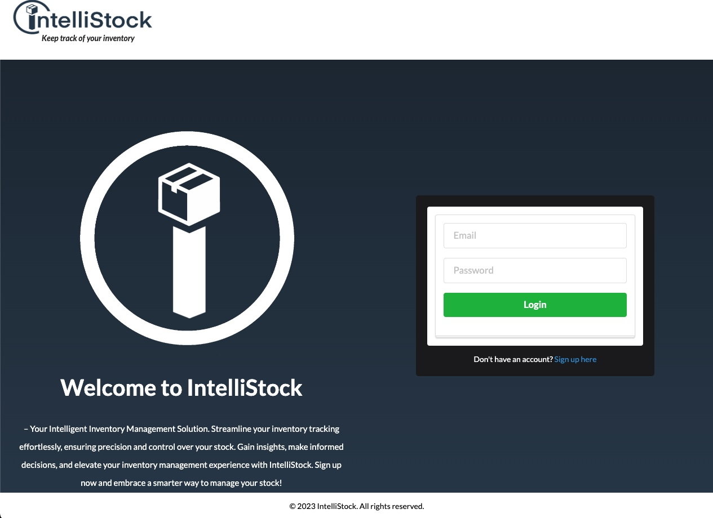

[](https://opensource.org/licenses/MIT)


# Intellistock - Inventory Tracking Full Stack App

Intellistock is a full-stack web application built with Vite and React, designed for efficient inventory tracking. It provides a user-friendly interface for managing and monitoring your inventory, helping businesses keep track of stock levels, sales, and restocking needs.

# Table of Contents
  - [Features](#features)
  - [Technologies](#techologies)
  - [Getting Started](#getting-started)
  - [License](#license)
  - [Contributors](#contributors)
  - [Link](#Link)
  - [Image](#Image)

## Features

- **User Authentication**: Securely log in and manage your inventory with user-specific access controls.
- **Intuitive Dashboard**: Get a quick overview of your inventory
- **Product Management**: Easily add, edit, and delete products from your inventory.
- **Stock Tracking**: Monitor stock levels and receive low-stock alerts
- **Responsive Design**: Access Intellistock from any device with a responsive and mobile-friendly design.

## Technologies

- **Vite**: Fast web framework for React
- **React**: A JavaScript library for building user interfaces

## Getting Started

1. Clone the repository:

   ```
   git clone https://github.com/akidd15/intellistock.git
   ```

2. Navigate to the project directory and install dependencies `npm install`

3. Start the development server `npm run develop`

4. Open browser and visit http://localhost:3000/ in your browser

##  License 

This project is licensed under the MIT License

## Contributors

Allison Kidd - [Github](https://github.com/akidd15)


Alissa Patterson - [Github](https://github.com/Apatterson32)


Jacob Maughan - [Github](https://github.com/jacslimob)


Jacob Preciado - [Github](https://github.com/jmpre28)


# Link 

- [Deployment](https://intellistock-production.up.railway.app/)

## Image 

